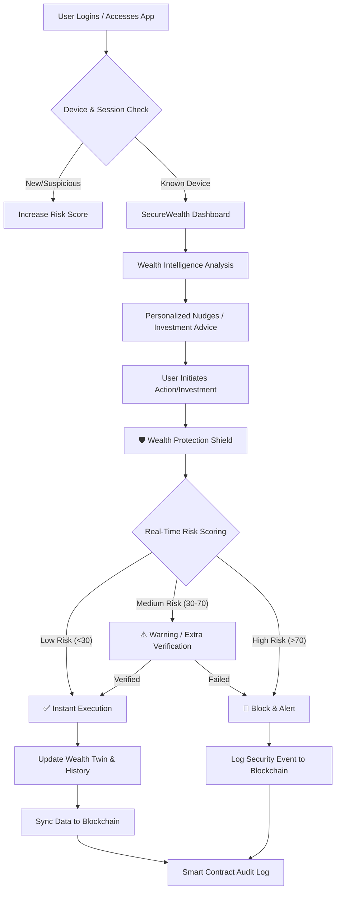

# SecureWealth Twin - Cyber Security & Fraud in Wealth Management

The goal is to build an AI-powered Wealth Management platform that integrates a **Cyber-Protection Layer** to safeguard users' financial decisions against fraud and cyber-risks.

## Proposed Tech Stack
- **Frontend**: React.js with Tailwind CSS (Modern, responsive UI with real-time dashboards).
- **Backend**: FastAPI (Python) - lightweight, fast, and ideal for ML integration.
- **Database**: PostgreSQL (Core Data) + HashiCorp Vault (Credential Storage).
- **Blockchain**: Ethereum/Solidity (or Hyperledger) for immutable audit trails and data integrity.
- **Smart Contracts**: Solidity-based contracts to govern data access and log validation.
- **ML/Logic**: Scikit-learn for basic predictive modeling and a custom Rule Engine for risk scoring.

---

## Project Workflow

The following workflow describes the end-to-end journey of a user interacting with the SecureWealth Twin, highlighting the interaction between the Wealth Twin and the Protection Layer.

### Detailed Workflow Steps:
1.  **Onboarding & Intelligence**: Upon login, the system performs a silent **Device Trust Check**. The **Wealth Intelligence Twin** then analyzes transaction history.
2.  **Credential Management**: All sensitive credentials are stored in an isolated **Secure Vault** (e.g., HashiCorp Vault).
3.  **Triggering an Action**: When the user clicks on a suggested investment, the **Wealth Protection Shield** intercepts the request.
4.  **Risk Assessment**: The engine evaluates context, velocity, and anomalies.
5.  **Decision & Blockchain Logging**: 
    *   Regardless of the outcome (Allow/Block), the event is hashed and sent to a **Smart Contract** on the blockchain.
    *   This ensures an **Immutable Audit Trail** that cannot be tampered with by administrators or attackers.
6.  **Data Synchronization**: Periodically, the state of the centralized databases is reconciled and a "state root" is committed to the blockchain for global integrity verification.

---

## Core Components

### 1. Wealth Intelligence Twin (The "Adviser")
- **Income/Expense Tracker**: Automated categorization of transactions.
- **Goal Manager**: Track progress for education, retirement, etc.
- **Nudge Engine**: Generative AI/Rule-based suggestions for SIPs, insurance, and savings based on user behavior.
- **Market Intelligence**: Integration with global market feeds for strategic asset allocation (Gold, Stocks, FDs).

### 2. Cyber-Protection Layer (The "Guardian")
- **Risk Scoring Engine**: A real-time engine that evaluates every transaction/action against:
    - **Device Trust**: Check if the device is known.
    - **Velocity Check**: Detect unusually fast actions after login.
    - **Anomaly Detection**: Flag amounts significantly higher than historical averages.
    - **Behavioral Analysis**: Monitor for suspicious patterns (e.g., multiple OTP retries).

### 3. Immutable Blockchain Audit Layer
- **Distributed Ledger**: Use a blockchain (simulated or real) to store hashes of all financial transactions and security alerts.
- **Smart Contracts**: 
    - **`AccessControl.sol`**: Manages who can view/verify logs.
    - **`AuditLogger.sol`**: Handles the logic for appending new, unchangeable records.
- **Credential Isolation**: Dedicated storage for user secrets, separate from the primary application database.

---

## Implementation Phases

### Phase 1: Data Foundation & "Full Picture" Net Worth
- **Framework Setup**: Initialize React (Frontend) and FastAPI (Backend).
- **Account Aggregator Integration**: Implement (mock) APIs to pull financial data from multiple banks to create a unified view.
- **Asset Vault**: Build modules for users to manually add and track **Property, Gold, and Vehicles**.
- **Net Worth Engine**: Calculate real-time net worth by combining bank balances and manually added assets.

### Phase 2: Behavioral Intelligence & Habit Learning
- **Habit Tracker**: Develop ML models to analyze **Spending, Saving, and Investment patterns**.
- **Dynamic Profiling**: Create a system that tracks changes in **Income, Financial Goals, and Risk Appetite**.
- **Core Guidance**: Implement the first set of nudges: monthly savings targets and basic portfolio suggestions.

### Phase 3: Strategic Market Intelligence (The "Strategist")
- **Global Market Monitor**: Integrate APIs for **Stocks, Funds, Interest Rates, Inflation, and Gold prices**.
- **Recommendation Engine**: Logic for strategic shifts (e.g., "Sell Gold/Shift to FD" based on global indicators like inflation or international events).
- **Advanced Advice**: Add modules for **Tax-Saving options**, goal acceleration (e.g., "Reach retirement 2 years faster"), and portfolio rebalancing.

### Phase 4: Cyber-Protection Shield & Blockchain Audit
- **Wealth Protection Shield**: Implement built-in **Risk Checks** (device trust, behavior consistency) that run silently during actions.
- **Blockchain Integration**: Deploy **Smart Contracts** to store immutable hashes of all financial advice and high-value actions.
- **Audit Logger**: Ensure every "Strategic Recommendation" and "Wealth Action" is logged to the blockchain for future auditing.

### Phase 5: Seamless UX & High-Value Simulation
- **Frictionless Security**: Optimize the UI to ensure risk checks don't complicate the user experience.
- **High-Value Journey**: Simulate a sensitive action (e.g., liquidating a large asset) to demonstrate the interplay between AI advice, risk scoring, and blockchain logging.

---

## Verification Plan
### Automated Tests
- **Market Sensitivity Test**: Verify the engine gives correct strategic advice when "Market Data" (simulated) changes.
- **Net Worth Accuracy**: Ensure manual asset appreciation/depreciation is correctly reflected in total net worth.
- **Risk Engine Bypass Attempt**: Attempt a high-value transaction with "suspicious" parameters to ensure it triggers the protection layer.

### Manual Verification
- **Full Journey Walkthrough**: Onboard -> Add Assets -> View Market Recommendations -> Initiate Action -> Verify Blockchain Log.
